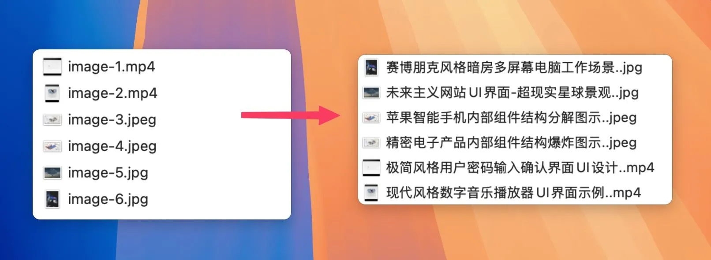

# Frame-Sense

<div align="center">


[](https://www.npmjs.com/package/@zhangziheng/frame-sense)
[](https://nodejs.org/)
[](https://www.typescriptlang.org/)
[](https://opensource.org/licenses/MIT)


🎯 **智能媒体文件重命名工具** - 基于 AI 的视频和图片文件自动语义化命名
<br/>
<br/>


</div>


Frame-Sense 是一个基于 AI 的智能命令行工具，结合 FFmpeg 和 Google Gemini AI 模型，自动分析视频和图片内容，生成语义化的文件名。支持批量处理、混合媒体类型处理，让文件管理变得更加智能和高效。

## 📋 目录

- [✨ 主要特性](#-主要特性)
- [📦 安装](#-安装)
- [🚀 快速开始](#-快速开始)
- [🔧 命令详解](#-命令详解)
- [⚙️ 系统要求](#️-系统要求)
- [🚨 注意事项](#-注意事项)
- [技术栈](#技术栈)
- [🌟 致谢](#-致谢)

## ✨ 主要特性

- 🎯 **AI 自动重命名** - 基于图像内容生成语义化文件名
- 📹 **视频 + 图片支持** - 自动提取视频帧，统一处理所有媒体文件
- ⚡ **批量处理** - 一次性处理整个目录，支持混合媒体类型
- 👀 **预览模式** - 先预览重命名结果，确认无误后再执行
- 🔧 **自定义配置** - 支持自定义 AI 提示词、批次大小、文件名长度
- 📁 **输出目录** - 可指定输出目录，避免覆盖原文件
- 🎬 **多种帧提取策略** - 支持单帧、多帧、关键帧等不同提取策略
- 🏷️ **文件名模板** - 支持自定义文件名模板，包含前缀、日期格式等
- 📅 **智能日期提取** - 自动从 EXIF 数据或文件系统提取日期信息

## 📦 安装

### 全局安装
```bash
npm install -g @zhangziheng/frame-sense
```

## 🚀 快速开始

### 1. 安装 FFmpeg（如已安装可跳过）

FFmpeg 是视频处理必需依赖，请根据您的系统安装：

#### macOS (使用 Homebrew)
```bash
brew install ffmpeg
```

#### Ubuntu/Debian
```bash
sudo apt update
sudo apt install ffmpeg
```

#### Windows (使用 Chocolatey)
```bash
choco install ffmpeg
```

#### 验证安装
```bash
ffmpeg -version
```

### 2. 配置 API Key
首次使用需要配置 Google Gemini API Key：

```bash
frame-sense config --api YOUR_GEMINI_API_KEY
```

API 注册地址：[Google AI Studio API](https://aistudio.google.com/apikey)

### 2. 处理单个文件
```bash
# 分析视频文件
frame-sense video.mp4

# 分析图片文件
frame-sense image.jpg

# 预览重命名结果（不实际重命名）
frame-sense video.mp4 --preview
```

### 3. 批量处理目录
```bash
# 处理目录中的所有媒体文件（自动识别为目录）
frame-sense /path/to/media/folder

# 预览批量重命名结果
frame-sense /path/to/media/folder --preview

# 指定输出目录
frame-sense /path/to/media/folder --output /path/to/output
```


### 使用示例

#### 基础使用
```bash
# 分析单个视频文件
frame-sense vacation.mp4

# 预览重命名结果
frame-sense vacation.mp4 --preview

# 批量处理目录（自动识别）
frame-sense ./photos

# 输出到指定目录
frame-sense ./videos --output ./renamed_videos
```

#### 高级配置
```bash
# 帧提取策略
frame-sense video.mp4 --frame-strategy

# 设置自定义提示模板
frame-sense config --custom-prompt "请详细描述这个图像的主要内容，包括人物、场景和动作"

# 设置文件名长度限制为20个字数
frame-sense config --filename-length 20

# 设置批处理大小为10
frame-sense config --batch-size 10

# 启用详细输出模式
frame-sense ./media --verbose
```

#### 文件名模板功能
```bash
# 自定义前缀
frame-sense --template '2025-11_{ai}' ./photos/

# 年月日期格式
frame-sense --template 'YYYY-MM-DD_{ai}' ./photos/

# 中文日期格式
frame-sense --template 'YYYY年MM月DD日_{ai}' ./photos/

# 直接使用描述
frame-sense --template '{desc}' ./photos/

# 配置默认模板
frame-sense config --template 'YYYY-MM_{ai}'

# 查看模板示例
frame-sense --template-examples
```

#### 系统检查
```bash
# 检查 API 连接
frame-sense --test

# 检查系统依赖（FFmpeg）
frame-sense --deps

# 查看支持的格式
frame-sense --formats

# 查看当前配置
frame-sense --config
```

## 🔧 命令详解

### 主命令
```bash
frame-sense [文件路径] [选项]
```

#### 选项说明
- `-p, --preview` - 预览重命名结果，不实际执行
- `-o, --output <dir>` - 指定输出目录
- `-b, --batch <size>` - 设置批量处理大小
- `-f, --frame-strategy [strategy]` - 设置帧提取策略，不带值时进入交互选择
- `-v, --verbose` - 启用详细输出和调试模式
- `-t, --test` - 测试 AI API 连接
- `--config` - 显示当前配置信息
- `--formats` - 显示支持的媒体格式
- `--deps` - 检查系统依赖
- `--template <template>` - 自定义文件名模板，支持变量替换
- `--date-source <sources>` - 日期来源优先级，逗号分隔
- `--template-examples` - 显示文件名模板示例


### 配置管理
```bash
frame-sense config [选项]
```

#### 配置选项
- `--api <key>` - 设置 Google Gemini API Key
- `--batch-size <size>` - 设置默认批量处理大小
- `--filename-length <length>` - 设置文件名字数长度限制
- `--custom-prompt <template>` - 设置自定义分析提示模板
- `--template <template>` - 设置默认文件名模板
- `--date-source <sources>` - 设置日期来源优先级
- `--reset-prompt` - 重置提示模板到默认值
- `--reset` - 重置所有配置到默认值
- `--show` - 显示当前配置

### 日期格式支持

| 格式 | 描述 | 示例 |
|------|------|------|
| `YYYY-MM-DD` | 完整日期 | `2024-12-25` |
| `YYYY-MM` | 年月格式 | `2024-12` |
| `YYYY` | 年份 | `2024` |
| `YYYYMMDD` | 紧凑日期 | `20241225` |
| `MM-DD` | 月日格式 | `12-25` |
| `YYYY年MM月DD日` | 中文日期 | `2024年12月25日` |

### 模板示例

```bash
# 查看所有模板示例
frame-sense --template-examples

# 自定义前缀
frame-sense --template '2025-11_{ai}' ./photos/
# 结果：2025-11_美丽的日落风景.jpg

# 日期 + AI 描述
frame-sense --template 'YYYY-MM-DD_{ai}' ./photos/
# 结果：2024-12-25_美丽的日落风景.jpg

# 年月 + AI 描述
frame-sense --template 'YYYY-MM_{ai}' ./photos/
# 结果：2024-12_美丽的日落风景.jpg

# 中文日期格式
frame-sense --template 'YYYY年MM月DD日_{ai}' ./photos/
# 结果：2024年12月25日_美丽的日落风景.jpg

# AI 描述在前
frame-sense --template '{ai}_YYYY-MM-DD' ./photos/
# 结果：美丽的日落风景_2024-12-25.jpg
```

### 日期来源优先级

Frame-Sense 支持从多个来源提取日期信息，按优先级顺序：

1. **EXIF 数据**：从图片的 EXIF 数据中提取拍摄日期
2. **文件创建时间**：文件系统的创建时间
3. **文件修改时间**：文件系统的修改时间

```bash
# 设置日期来源优先级
frame-sense --template 'YYYY-MM_{ai}' --date-source 'exif,created,modified' ./photos/

# 只使用 EXIF 数据
frame-sense --template 'YYYY-MM_{ai}' --date-source 'exif' ./photos/

# 只使用文件创建时间
frame-sense --template 'YYYY-MM_{ai}' --date-source 'created' ./photos/
```

## ⚙️ 系统要求

### 运行环境
- **Node.js**: >= 18.0.0
- **FFmpeg**: 用于视频处理（必需，安装步骤见快速开始）
- **Google Gemini API Key**: 用于 AI 分析

### 系统检查
```bash
# 检查所有依赖是否正确安装
frame-sense --deps
```

### 帧提取策略详解

Frame-Sense 提供三种不同的帧提取策略，适应不同的使用场景：

| 策略 | 说明 | 适用场景 | 优势 | 注意事项 |
|------|------|----------|------|----------|
| **single** | 提取第10帧作为代表帧 | 快速预览、简单内容视频 | 处理速度快、资源占用少 | 可能错过重要内容变化 |
| **multiple** | 均匀提取5帧覆盖整个视频 | 一般视频内容、教程视频 | 内容覆盖全面、结果可控 | 处理时间适中 |
| **keyframes** | 提取所有关键帧（场景变化点） | 复杂场景、动作密集视频 | 捕获所有重要场景变化 | 提取帧数不可控、耗时较长 |

**配置帧提取策略：**

通过交互式选择设置（推荐）：
```bash
# 处理视频时交互式选择帧提取策略
frame-sense video.mp4 --frame-strategy

# 或者直接指定策略
frame-sense video.mp4 --frame-strategy multiple
frame-sense video.mp4 --frame-strategy keyframes
frame-sense video.mp4 --frame-strategy single
```

通过配置文件设置：
```bash
# 查看当前配置
frame-sense --config

# 手动编辑配置文件，修改 frameExtractionStrategy 字段：
# ~/.config/frame-sense-nodejs/frame-sense.json
{
  "frameExtractionStrategy": "multiple"  // 可选：single, multiple, keyframes
}
```

**策略选择建议：**
- 📷 **日常视频、Vlog** → `single`（快速处理）
- 🎬 **电影、长视频** → `multiple`（全面覆盖）
- 🎮 **游戏录像、运动视频** → `keyframes`（捕获动作变化）
- 📚 **教程、演示视频** → `multiple`（平衡效果与速度）

### 混合批处理优化
- **智能分组**: 将图片和视频帧混合分组，最大化 AI API 使用效率
- **并行处理**: 支持多文件同时处理，提升整体速度
- **内存管理**: 合理管理临时文件和内存使用
- **错误恢复**: 单个文件失败不影响整体处理进程

## 🚨 注意事项

### API 使用限制
- Google Gemini API 有调用频率限制
- 建议合理设置批处理大小，避免超出限制
- 大量文件处理时建议分批进行

### 性能优化建议
- 对于大量文件，建议使用 `--batch-size` 参数调整批处理大小
- 视频文件处理相对较慢，因为需要提取帧
- 启用 `--verbose` 模式可以查看详细的处理信息

### 数据安全
- 图像数据会发送到 Google Gemini API 进行分析
- 不会永久存储用户的图像数据


## 🌟 致谢

- [Google Gemini AI](https://ai.google.dev/) - 提供强大的图像识别能力（主要是免费😅）
- [FFmpeg](https://ffmpeg.org/) - 视频处理核心
- [Sharp](https://sharp.pixelplumbing.com/) - 高性能图像处理

---

<div align="center">

**让文件管理变得更智能** 🚀

[GitHub](https://github.com/Shadowzzh/frame-sense) • [NPM](https://www.npmjs.com/package/@zhangziheng/frame-sense) • [Issues](https://github.com/Shadowzzh/frame-sense/issues)

</div>